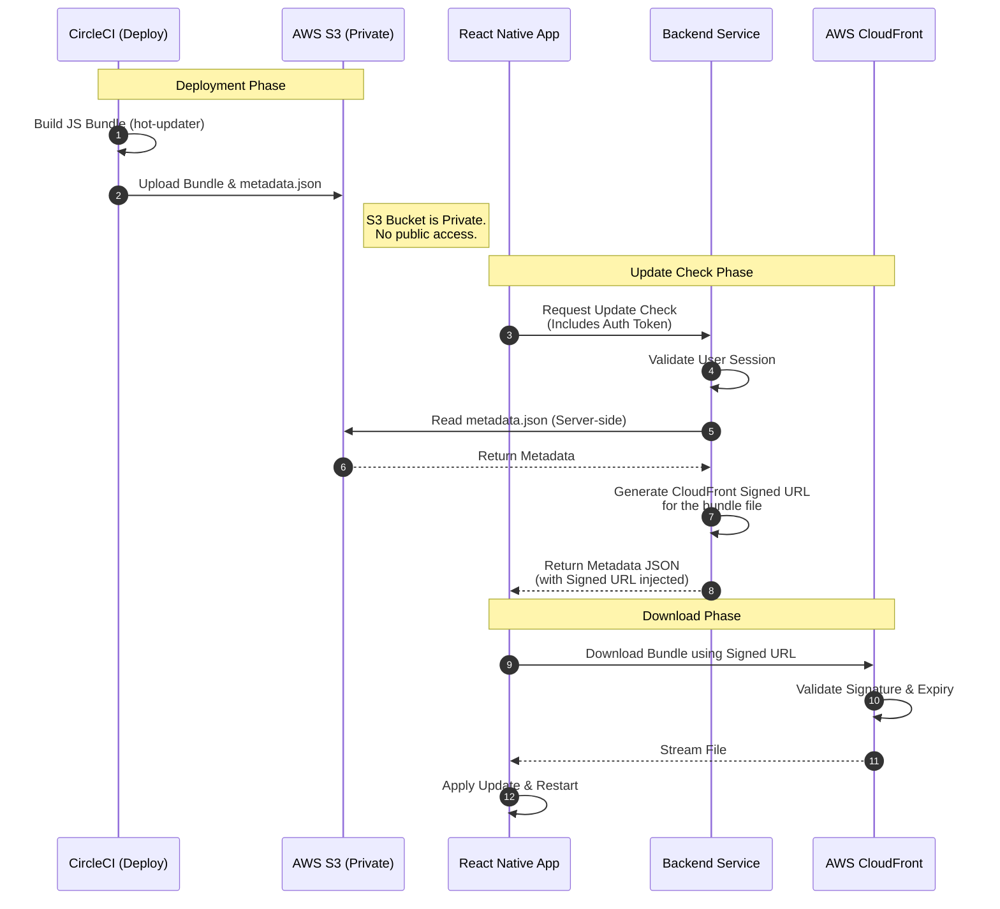

# Secure React Native OTA Architecture
## Powered by Hot Updater, AWS S3, CloudFront, and Signed URLs

This document outlines the architecture for a secure, self-hosted Over-The-Air (OTA) update system for a React Native application. This setup ensures that only authenticated users can download application code, protecting intellectual property and preventing unauthorized access.

### 1. Architecture Diagram



---

### 2. Key Components

| Component | Role | Configuration |
|-----------|------|---------------|
| **React Native App** | The Client | Uses `hot-updater` client. Configured to poll the **Backend API** instead of the CDN directly. |
| **CircleCI** | The Builder | Runs `npx hot-updater deploy`. Has AWS credentials to write to S3. |
| **AWS S3** | The Storage | **Private Bucket**. Stores `index.bundle` and `metadata.json`. Blocks all public access. |
| **AWS CloudFront** | The Delivery | Connected to S3. Configured with **Restricted Viewer Access** (requires signed URLs). |
| **Backend API** | The Gatekeeper | A Node.js/Lambda service. Authenticates the user, reads metadata from S3, and signs the CloudFront URL. |

---

### 3. Detailed Workflow

#### Phase A: Deployment (CircleCI)
1.  Developer pushes code to `main`.
2.  CircleCI triggers the `deploy-ota` job.
3.  `hot-updater` builds the bundle (e.g., `index.android.bundle`).
4.  `hot-updater` uploads the bundle and updates `metadata.json` in the **Private S3 Bucket**.

#### Phase B: The Secure Check (Runtime)
1.  The App initializes `HotUpdater` pointing to `https://api.myapp.com/ota` (not CloudFront).
2.  The App sends a request: `POST /ota/check` with an `Authorization: Bearer <token>` header.
3.  **The Backend API**:
    *   Validates the token.
    *   Downloads `metadata.json` from S3 using the server's IAM permissions.
    *   Parses the JSON to find the `url` field (e.g., `https://cdn.com/bundle.js`).
    *   **Signs the URL**: Uses a CloudFront Private Key to append a signature (e.g., `?Policy=...&Signature=...`).
    *   Returns the modified JSON to the App.

#### Phase C: Download
1.  The App receives the JSON containing the **Signed URL**.
2.  The App instructs `hot-updater` to download from that specific URL.
3.  CloudFront validates the signature. If valid and not expired, it serves the file.

---

### 4. Implementation Guide

#### A. Backend Logic (Node.js Example)
This is the code you would run on your Lambda or Backend API.

```typescript
import { getSignedUrl } from "@aws-sdk/cloudfront-signer";
import { S3Client, GetObjectCommand } from "@aws-sdk/client-s3";

const s3 = new S3Client({ region: "us-east-1" });
const CLOUDFRONT_KEY_PAIR_ID = process.env.CF_KEY_PAIR_ID;
const CLOUDFRONT_PRIVATE_KEY = process.env.CF_PRIVATE_KEY;

export const checkUpdateHandler = async (req, res) => {
  const { platform } = req.query; // 'ios' or 'android'
  
  // 1. Security: Validate Auth Token
  if (!req.user || !req.user.isAuthenticated) {
    return res.status(401).json({ error: "Unauthorized" });
  }

  try {
    // 2. Fetch Metadata from Private S3
    const command = new GetObjectCommand({
      Bucket: process.env.S3_BUCKET_NAME,
      Key: `${platform}/metadata.json`,
    });
    const s3Response = await s3.send(command);
    const metadataStr = await s3Response.Body.transformToString();
    const metadata = JSON.parse(metadataStr);

    // 3. Generate Signed URL for the bundle
    // Assuming metadata.url is the public CloudFront URL
    const signedBundleUrl = getSignedUrl({
      url: metadata.url,
      keyPairId: CLOUDFRONT_KEY_PAIR_ID,
      privateKey: CLOUDFRONT_PRIVATE_KEY,
      dateLessThan: new Date(Date.now() + 1000 * 60 * 15), // Valid for 15 mins
    });

    // 4. Replace the public URL with the signed one
    metadata.url = signedBundleUrl;

    // 5. Return to client
    res.json(metadata);
    
  } catch (error) {
    console.error("Error fetching OTA metadata", error);
    res.status(500).json({ error: "Internal Server Error" });
  }
};
```

#### B. Client Logic (React Native)
Configure the updater to talk to your API.

```typescript
import { HotUpdater } from 'hot-updater-react-native';

const initOTA = async () => {
  // 1. Get your auth token
  const token = await auth().currentUser.getIdToken();

  // 2. Initialize pointing to YOUR API, not the CDN
  await HotUpdater.init({
    source: "https://api.myapp.com/ota", 
    requestHeaders: {
      Authorization: `Bearer ${token}`
    }
  });

  // 3. Check and Update
  const update = await HotUpdater.check();
  if (update) {
    await HotUpdater.download(update);
    await HotUpdater.reload();
  }
};
```

---

### 5. Use Case ASCII Diagram

This diagram illustrates how the system handles valid users versus attackers.

```text
+-----------------------------------------------------------------------------------+
|                                  USER DEVICES                                     |
+-----------------------------------------------------------------------------------+
|                                                                                   |
|   +-------------+           +-------------+               +-------------+         |
|   | Valid User  |           |   Attacker  |               |   Attacker  |         |
|   | (Logged In) |           | (No Token)  |               | (Direct URL)|         |
|   +------+------+           +------+------+               +------+------+         |
|          |                         |                             |                |
|          | 1. Check Update         | 1. Check Update             | 1. GET File    |
|          | (With Token)            | (No Token)                  | (No Signature) |
|          v                         v                             v                |
+----------+-------------------------+-----------------------------+----------------+
|                                    |                             |                |
|        API GATEWAY / LAMBDA        |                             |                |
|   +---------------------------+    |                             |                |
|   |  Auth Check: PASS         |    |                             |                |
|   |  Fetch Metadata (S3)      |    |                             |                |
|   |  Sign URL (CloudFront)    |    |                             |                |
|   +-------------+-------------+    |                             |                |
|                 |                  |                             |                |
|                 | 2. Return JSON   | 2. 401 Unauthorized         |                |
|                 | (Signed URL)     | (Blocked)                   |                |
|                 v                  x                             |                |
|   +-------------+-------------+                                  |                |
|   |      Valid User App       |                                  |                |
|   |    (Receives URL)         |                                  |                |
|   +-------------+-------------+                                  |                |
|                 |                                                |                |
|                 | 3. Download Bundle                             |                |
|                 | (With Signature)                               |                |
|                 v                                                |                |
+-----------------+------------------------------------------------+----------------+
|                 |                                                |                |
|           CLOUDFRONT CDN                                         |                |
|   +-------------+-------------+                                  |                |
|   |  Check Signature: PASS    |                                  |                |
|   |  Serve File               | <--------------------------------+                |
|   +-------------+-------------+                                    2. 403 Forbidden
|                 ^                                                  (Blocked)      |
|                 |                                                                 |
|           AWS S3 (PRIVATE)                                                        |
|   +-------------+-------------+                                                   |
|   |  index.android.bundle     |                                                   |
|   +---------------------------+                                                   |
|                                                                                   |
+-----------------------------------------------------------------------------------+
```

---

### 6. Architecture Comparison

| Feature | Direct to CDN (Simple) | API + Public URL (Managed) | API + Signed URL (Secure) |
| :--- | :--- | :--- | :--- |
| **Architecture** | App -> CloudFront | App -> API -> CloudFront | App -> API -> CloudFront (Signed) |
| **Complexity** | Low (Client only) | Medium (Client + Server) | High (Client + Server + Signing) |
| **Security** | ⚠️ Low (Public URL) | ⚠️ Low (Public URL) | 🔒 **High (Private URL)** |
| **Access Control** | None (Anyone with URL) | Basic (API Auth) | **Strict (Token + Signature)** |
| **Code Protection** | None | Obscured (URL hidden) | **Protected (Cannot download without auth)** |
| **Cost** | $ (S3 + CF) | $$ (S3 + CF + Lambda) | $$ (S3 + CF + Lambda) |
| **Latency** | ⚡ Fastest | Fast | Fast (Minor API overhead) |
| **Best For** | Public Apps, MVPs | Apps needing complex rollout logic | **Enterprise, Paid Apps, IP Protection** |
